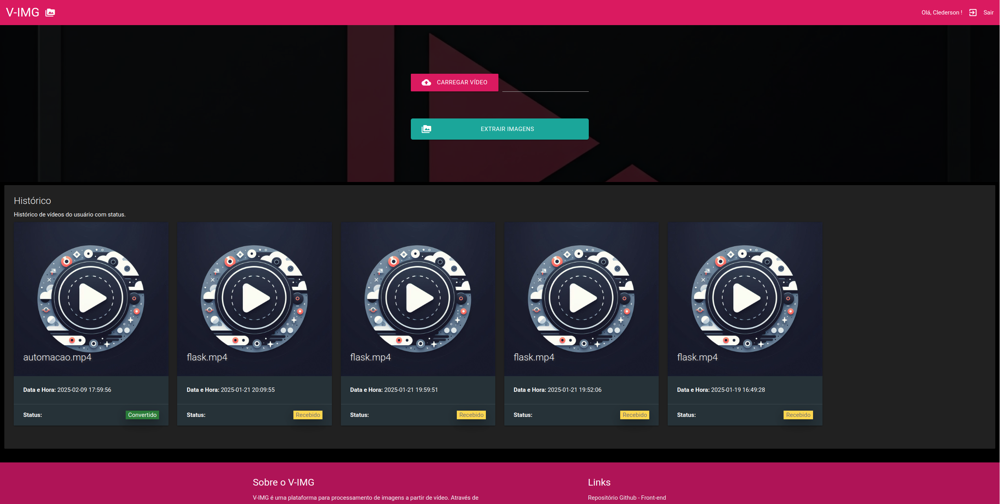
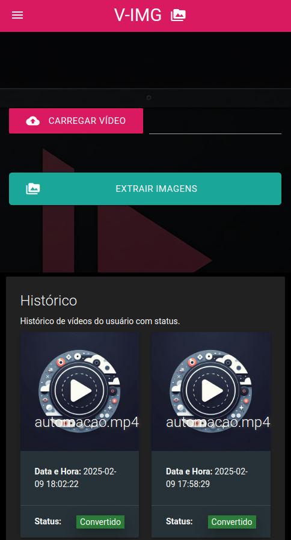
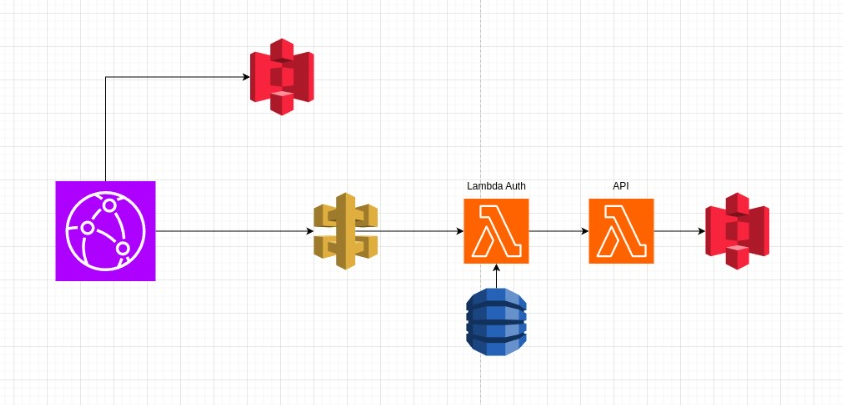

# API para Processamento de Imagens

Este repositório contém a API da aplicação de multiprocessamento de vídeos da **FIAP X**. A API permite que os usuários façam multiupload de vídeos, acompanhem o status do processamento e façam o download dos arquivos gerados.

<p align="center">
    </img><br>
    <span>Interface do sistema - web</span>
</p>
<br>
<p align="center">
    </img><br>
    <span>Interface do sistema - mobile</span>
</p>

## Tecnologias Utilizadas

- **Python 3.13.1**
- **Flask** framework da API
- **Docker** para containerização

## Arquitetura

O sistema é composto por dois microsserviços principais:
1. **API de Processamento de Imagens (Flask)**: responsável por receber os vídeos, processá-los e armazenar os resultados.
2. **Front-end (Flask)**: interface para os usuários interagirem com o sistema.

A API segue um modelo de arquitetura serverless, onde o processamento de imagens é feito de forma assíncrona usando chamdas REST. Os vídeos são armazenados no AWS S3, e o processamento ocorre através de funções AWS Lambda que são escaláveis conforme a demanda.

<p align="center">
    </img><br>
    <span>Arquitetura Servless</span>
</p>

## Funcionalidades

* Recebimento do upload de vídeos para processamento nos formatos MP4, AVI, MOV, MKV e M4A.
* Geração de imagens a partir dos vídeos enviados no formato JPEG.
* Armazenamento das imagens processadas no AWS S3.
* Download das imagens compactadas em um arquivo .zip.
* Retorno do status dos vídeos de um usuário.
* Notificação em caso de erro no processamento.

## Instalação e Configuração

### Pré-requisitos

- Python 3.13.1 instalado
- Docker instalado (para ambiente de desenvolvimento)
- API de Processamento de Imagens em funcionamento

### Passos para rodar localmente

1. Clone o repositório:

   ```bash
   git clone https://github.com/6SOATGP54/hackathon-api
   cd hackathon-web
   ```

2. Crie e ative um ambiente virtual:

   ```bash
   python -m venv venv
   source venv/bin/activate  # Linux/Mac
   venv\Scripts\activate  # Windows
   ```

3. Instale as dependências:

   ```bash
   pip install -r requirements.txt
   ```

4. Configure as variáveis de ambiente no arquivo `.env`:

    ```env
        FLASK_APP=app.py
        FLASK_ENV=development
        SECRET_KEY=sua_chave_secreta
        AWS_ACCESS_KEY_ID=sua_chave_aws
        AWS_SECRET_ACCESS_KEY=sua_chave_secreta_aws
        S3_BUCKET_NAME=seu_bucket
    ```

5. Execute a aplicação:

   ```bash
   python run.py
   ```

## Estrutura do Projetos

O projeto segue princípios da arquitura em camadas, definindo e isolando responsabilidades com a aplicação de padrões de projeto que facilitam a manutenção e evolução do código para novas funcionalidades ou necessidades futuras.

## Testes

Para rodar os testes unitários:

```bash
python -m unittest discover tests
```

Para rodar os testes funcionais:
* Acesse [Testes Funcionais Automatizados do Sistema](https://github.com/6SOATGP54/hackathon-automated-tests) e siga o passo a passo para execução da esteira e geração de relatórios de teste.

## Segurança

Além do desenho de arquitetura, alguns detalhes de implementação tornam a aplicação robusta e segura ao mesmo tempo.
* A API só é acessada dentro da VPC designada
* Todas as senhas são criptogradas com Bcrypt
* As principais rotas da aplicação são restritas aos usuários autenticados
* As interações com o banco são intermediadas pelo ORM (SQLAlchemy)
* ...

## Contato

Grupo nº 54 da turma 6SOAT/2024 do curso lato sensu "Especialização em Arquitetura de Software" composto por:
- Bruno Matias
- Clederson Cruz
- Lucas Santiago
